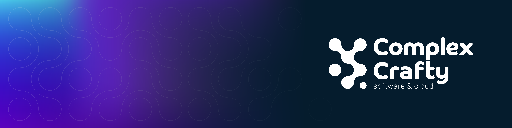

**Building sophisticated software solutions with human-centered design.**

Complex Crafty is a software development and cloud architecture consultancy specializing in crafting robust, scalable, and adaptable solutions for complex business problems. We pride ourselves on building long-term partnerships with our clients, understanding their unique needs, and providing them with the support they need to succeed.  We believe in building a relationship with our clients, and treat each client individually and with empathy.

## Our Expertise

We offer comprehensive services, from initial concept through to deployment and ongoing maintenance.  Our core competencies include:

* **Complex Systems Mastery:** We tackle challenging projects, specializing in areas like:
    * Complex engineering systems
    * Healthcare and life sciences
    * High-stakes business applications

* **Legacy System Modernization:** We seamlessly migrate outdated systems to current cloud-native and scalable architectures.

* **Growth-Oriented Development:** We build software that can evolve alongside your business needs, adapting to changing requirements and scaling with your growth.

## Our Technical Prowess

We bring a deep understanding of cutting-edge technology and best practices to every project:

* **Cloud Expertise:** We boast strong expertise in AWS cloud infrastructure, alongside familiarity with other major cloud providers.
* **Architectural Excellence:** We employ sophisticated software architecture principles to ensure robust and scalable solutions.
* **Agile Methodology:** We utilize highly adaptable project methodologies, incorporating the principles of human-centered design for exceptional user experiences.

## Our Values

* **Empathy & Collaboration:** We value strong, collaborative partnerships built on mutual understanding and respect.
* **Craftsmanship:** We take pride in our work, delivering high-quality solutions that meet or exceed client expectations.
* **Continuous Improvement:** We embrace agile development methodologies, making ongoing improvements to our processes and services.

## Let's Collaborate

Are you facing complex challenges in your industry that require a bespoke software solution? Contact us to discuss how we can help turn your vision into a reality.

[Link to Website](https://complexcrafty.com)
[Contact Email](contact@complexcrafty.com)

## Contributing

We welcome contributions to our open-source projects. Please take a look at the individual repositories for contribution guidelines.
